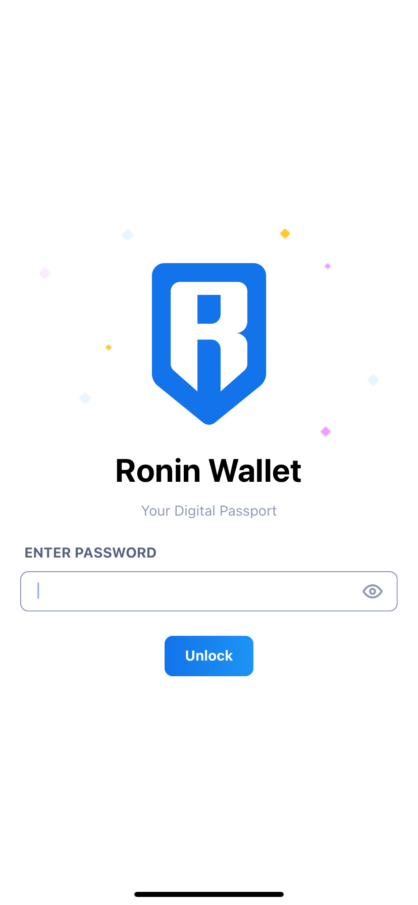
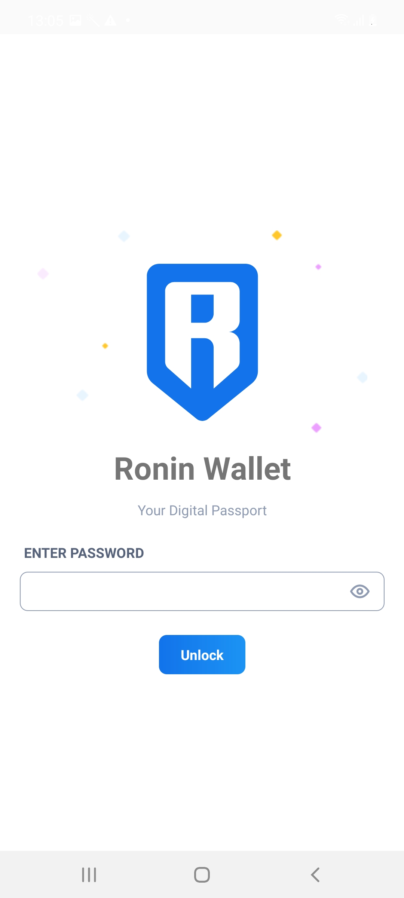
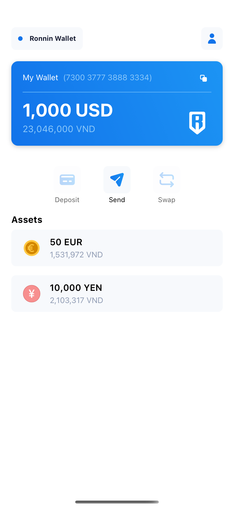
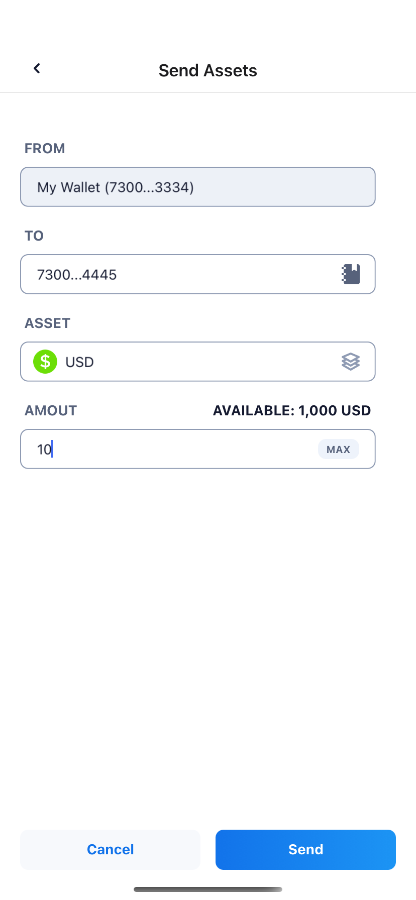
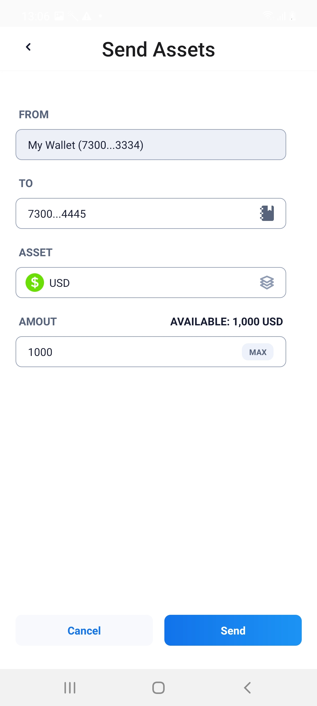

# Ronin Wallet Example

## User Story

#### I. As a user when I opened the app I can see login screen:

- I can type a password to login and navigate to home screen when login successful.

#### II. When I stayed home screen I can see:

- The default asset and the current balance.
- The list of assets that belong to default account
- The button group that allows deposit, send, swap the asset.

#### III. When I navigate to send asset screen I can see:

- The form that allows fill required information to send.
- After sent successful I can see an notification modal and able to click on OK button go back to the home screen.

## Requiement to development

- [Nodejs](https://nodejs.org/en/)
- [React native](https://reactnative.dev/)
- [ReactJs](https://reactjs.org/)
- [Redux](https://redux.js.org/)
- [Redux Saga](https://redux-saga.js.org/)
- [React Navigation](https://reactnavigation.org/)
- [Typescript](https://www.typescriptlang.org/)
- [Unit Test Jest](https://jestjs.io/docs/en/tutorial-react-native)

**First at all: clone project and install package with yarn**

Open your favorite Terminal and run these commands.

```sh
git clone https://github.com/phivh/rnewallet.git
cd rnewallet && yarn
```

#### The command to run development

```sh
yarn start

Run to android in another terminal.
Create local.properties file in android folder with this template, replace USER_NAME by computer username.

- sdk.dir=/Users/<USER_NAME>/Library/Android/sdk

Then run:
- yarn android

Run to ios in another terminal
- yarn ios

Run to ios with "iPhone 11" in another terminal
- yarn ip11
```

#### The command to run test

```sh
Run test all unit test
- yarn test
```

## Screenshots

| iOS                                                    | Android                                                    |
| ------------------------------------------------------ | ---------------------------------------------------------- |
|  |  |
|  |  |
|  |  |

Thanks & cheers!
